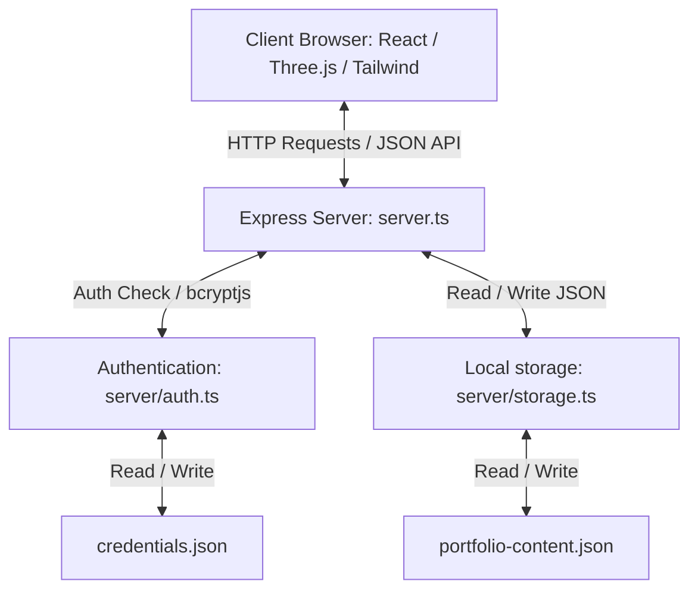

# Portfolio


A professional, high-performance, single-page application (SPA) portfolio website showcasing the work, skills, and projects of Gurucharan M. This repository features an interactive 3D frontend integrated with a secured Express.js backend administration dashboard.


---

## Live Demo

* [View App in AI Studio](https://ai.studio/apps/0afb1ad1-51bb-465d-9e05-23ac5fe86cf5)
* _Add custom production URL here once deployed outside of AI Studio_

---

## About the Project

This project serves as a dynamic, interactive portfolio for Gurucharan M, a Computer Science undergraduate student specializing in full-stack web development and embedded IoT prototyping. The application is split into a fluid, animations-rich frontend and a server-side API managing the portfolio data dynamically. It allows recruiters and visitors to interactively navigate achievements while giving the owner a secure login portal to manage content directly on the server without modifying code.

---

## Features

- **Interactive 3D WebGL Canvas**: Custom rotating 3D elements powered by React Three Fiber and Three.js for visual immersion.
- **Micro-Animations & Smooth Scrolling**: GSAP (GreenSock) and Lenis integration delivering seamless page scrolling and high-fidelity entrance animations.
- **Spotlight Command Palette (`Ctrl + K`)**: Keyboard-accessible interface enabling visitors to quickly navigate sections, trigger resume downloads, and toggle dark/light themes.
- **Dynamic Contact Form**: Email integration powered by EmailJS client SDK to send messages directly from the contact section.
- **Secured Admin Dashboard**: Dynamic content updates through an integrated dashboard panel at `/admin` (changing skills, experience timelines, project cards, and certificates).
- **Brute-Force Lockout Protection**: IP-based in-memory rate limiting that blocks clients for 15 minutes after 5 consecutive failed login attempts.

---

## Admin Dashboard

The portfolio includes an administrative management system accessible at `/admin`.

- **Authentication**: Secured using JSON Web Tokens (JWT) stored in HTTP-Only, strict cookies (`admin_token`) for session isolation.
- **Password Security**: Credentials stored as one-way Bcrypt hashes (`bcryptjs`) within the local storage layer.
- **Protected Actions**: Middleware validation (`requireAuth`) guards content updates (`PUT /api/portfolio`), dashboard resets (`POST /api/portfolio/reset`), and credentials modification (`POST /api/admin/change-password`).
- **Management Panel**: Built-in React components to modify contact details, add or delete project listings, customize skill levels, and update resume timelines.

---

## Tech Stack

| Dependency | Category | One-Line Purpose |
| :--- | :--- | :--- |
| `react` | Frontend Core | Component rendering, state management, and custom hooks. |
| `vite` | Tooling / Build | Next-generation frontend developer server and production bundler. |
| `@react-three/fiber` | 3D Graphics | React wrapper around Three.js WebGL rendering context. |
| `@react-three/drei` | 3D Graphics | Helper helpers and scene objects for React Three Fiber. |
| `three` | 3D Graphics | WebGL rendering library for displaying 3D objects. |
| `tailwindcss` | Styling | Utility-first CSS framework for responsive layout designs. |
| `gsap` | Animation | GreenSock Animation Platform for smooth timeline-based interface transitions. |
| `motion` | Animation | Framer Motion library for declarative micro-animations. |
| `lenis` | UX / Scrolling | High-performance smooth scrolling engine. |
| `express` | Backend Core | Routing framework and server-side REST API handler. |
| `bcryptjs` | Security | Secure password hashing algorithm for credential verification. |
| `jsonwebtoken` | Security | User session validation via signed JWT payloads. |
| `cookie-parser` | Security / Utility | Session cookie extraction and client validation middleware. |
| `lucide-react` | Icons | Clean, modular SVG iconography for UI elements. |
| `@emailjs/browser` | Messaging | Direct integration to dispatch contact forms to EmailJS servers. |
| `@google/genai` | AI / Future | Google Gemini SDK included for future AI-powered agent features. |

---

## Project Architecture



---

## Database

This application utilizes local, lightweight JSON-based files as its persistence layer.

- **`server/data/portfolio-content.json`**: Acts as the main collection containing all dynamic portfolio configurations (personal details, biography, certificates list, projects, and work experience items).
- **`server/data/credentials.json`**: Holds the administrator's account username and the hashed bcrypt password.

---

## Project Structure

```text
.
├── assets/
│   └── .aistudio/
│       └── .gitignore
├── public/
│   └── avatar.svg
├── server/
│   ├── data/
│   │   ├── credentials.json
│   │   └── portfolio-content.json
│   ├── auth.ts
│   └── storage.ts
├── src/
│   ├── components/
│   │   ├── 3d/
│   │   │   ├── CubesScene.tsx
│   │   │   └── HeroScene.tsx
│   │   ├── admin/
│   │   │   ├── AdminDashboard.tsx
│   │   │   └── AdminLogin.tsx
│   │   ├── sections/
│   │   │   ├── About.tsx
│   │   │   ├── Certificates.tsx
│   │   │   ├── Contact.tsx
│   │   │   ├── Education.tsx
│   │   │   ├── Experience.tsx
│   │   │   ├── GithubStats.tsx
│   │   │   ├── Hero.tsx
│   │   │   ├── Projects.tsx
│   │   │   └── Skills.tsx
│   │   └── ui/
│   │       ├── CommandPalette.tsx
│   │       ├── CustomCursor.tsx
│   │       ├── Footer.tsx
│   │       ├── Navbar.tsx
│   │       ├── Preloader.tsx
│   │       └── ResumeModal.tsx
│   ├── context/
│   │   ├── PortfolioContext.tsx
│   │   └── ThemeContext.tsx
│   ├── data/
│   │   └── portfolioData.ts
│   ├── types/
│   │   └── portfolio.ts
│   ├── App.tsx
│   ├── index.css
│   └── main.tsx
├── .env.example
├── .gitignore
├── index.html
├── package.json
├── server.ts
├── tsconfig.json
└── vite.config.ts
```

---

## Installation & Running Locally

### Prerequisites
Make sure you have [Node.js](https://nodejs.org/) installed.

### Setup Steps

1. **Install Dependencies**:
   ```bash
   npm install
   ```

2. **Configure Environment Variables**:
   Create a `.env` file in the root directory (based on `.env.example`):
   ```bash
   # Create file on Windows (PowerShell):
   Copy-Item .env.example .env
   ```

3. **Launch the Development Server**:
   Runs the bundler and Express backend server:
   ```bash
   npm run dev
   ```

4. **Production Build & Compilation**:
   Build the static files and compile the Express backend bundle:
   ```bash
   npm run build
   ```

5. **Start Production Server**:
   Launch the compiled production bundle:
   ```bash
   npm run start
   ```

6. **Other Scripts**:
   - Preview static bundle: `npm run preview`
   - Clean compiled assets: `npm run clean`
   - TypeScript lint check: `npm run lint`

---

## Environment Variables

> [!WARNING]
> Never commit `.env` configuration files to version control. They contain secure API keys and admin session secrets.

| Environment Variable | Required | Default Value | Description |
| :--- | :--- | :--- | :--- |
| `JWT_SECRET` | **Yes** | `your-secret-key-here` | Secret key used to sign JWT session cookies. The backend server will fail to start if this is undefined. |
| `ADMIN_USERNAME` | No | `admin` | Custom username for the dashboard admin login. |
| `ADMIN_PASSWORD` | No | `Guru@Admin2028!` | Default initial password hashed and stored on startup. |
| `GEMINI_API_KEY` | No | - | API key used for Google Gemini AI features. |
| `APP_URL` | No | - | Active deployment URL of the hosted application (for callbacks/references). |

---

## API Documentation

### Public Endpoints
- **`GET /api/portfolio`**: Returns the complete portfolio dataset from `portfolio-content.json`.
- **`GET /api/auth/status`**: Checks whether the client IP is currently locked out from trying to log in.
- **`POST /api/auth/login`**: Accepts `{ username, password }` and issues an HTTP-Only session token if valid.
- **`GET /api/auth/me`**: Returns active administrator session details by validating cookie JWT values.
- **`POST /api/auth/logout`**: Clears active JWT cookie configurations.

### Protected Endpoints (Requires `admin_token` Cookie)
- **`POST /api/admin/change-password`**: Accepts `{ currentPassword, newPassword, newUsername }` to reset the administrator login credentials.
- **`PUT /api/portfolio`**: Saves incoming portfolio configurations directly into the storage JSON file.
- **`POST /api/portfolio/reset`**: Resets the portfolio JSON structure back to the hardcoded default seed data.

---

## Security Details

- **Cryptographic Salting**: Admin credentials are encrypted using `bcryptjs` with 10 salt rounds before storage.
- **Secure Authentication**: Cookies (`admin_token`) are marked with `httpOnly: true` and `sameSite: 'strict'` to prevent XSS-based cookie theft. In production mode, cookies are set to `secure: true`.
- **Brute Force Defense**: Lockout rules configured inside `server/auth.ts` lock an IP address out for 15 minutes if it triggers 5 invalid logins.
- **Safe JSON Parsing**: Restricts payload body sizes to a max of 10MB (`express.json({ limit: '10mb' })`) to prevent system buffer overload attacks.

---

## Deployment

No direct infrastructure deployment configuration files (like `render.yaml` or Vercel config) exist in the root repository.
To host this full-stack application on platforms like Render, Railway, or Heroku:
1. Set up a Web Service target.
2. Build command: `npm run build`
3. Start command: `npm run start`
4. Set environment variable `NODE_ENV=production` and supply a secure `JWT_SECRET`.

---

## Screenshots

<!-- Add screenshots here -->
_No screenshots are currently uploaded to the repository. Please take a snapshot of the portfolio home and admin pages and save them to `/public` to link them here._

---

## Future Improvements

1. **Active Gemini Integrations**: Configure `@google/genai` to dynamically draft project details or answer client inquiries on-the-fly.
2. **Database Integration**: Replace file-system JSON serialization with a database provider like PostgreSQL or MongoDB.
3. **Containerization**: Define a docker workflow (`Dockerfile`) for easier scaling and deployment setups.

---

## Author

- **Gurucharan M** - [GitHub Profile](https://github.com/gurucharan-miller)